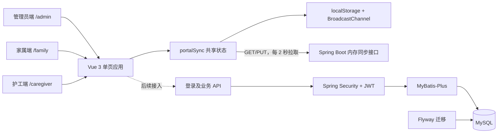

# 技术实现

## 1. 文档说明

本文档依据当前仓库代码编写，用于说明住院陪护系统已经采用的技术栈、前后端代码组织方式、数据库结构、登录权限和三端数据同步实现。

文档中的“当前实现”表示仓库中已经存在可运行代码；“规划能力”表示规格文档已设计，但尚未完成生产级代码接入。

## 2. 当前实现概览

| 领域 | 当前实现 | 状态 |
| --- | --- | --- |
| 管理员端 | Vue 3 单页界面，访问路径 `/admin` 或 `/` | 已实现原型 |
| 家属端 | Vue 3 移动端界面，访问路径 `/family` | 已实现原型 |
| 护工端 | Vue 3 移动端界面，访问路径 `/caregiver` | 已实现原型 |
| 三端同步 | Vue 响应式状态、本地存储、浏览器广播、后端内存快照 | 已实现原型 |
| 后端基础工程 | Spring Boot、统一响应、统一异常、参数校验、跨域配置 | 已实现 |
| 登录权限 | Spring Security、JWT、BCrypt、角色拦截、首次改密 | 后端已实现 |
| 数据库结构 | Flyway 创建 18 张业务表 | 已实现 |
| 数据持久化代码 | `sys_user` 实体、仓储和账号服务 | 已实现 |
| 业务持久化代码 | 患者、护工、申请、排班、任务等实体和接口 | 尚未实现 |
| Redis、MinIO | 规格文档已规划 | 尚未接入 |
| 自动化测试 | Maven 已引入测试依赖 | 尚无测试代码 |

## 3. 系统架构

项目采用前后端分离的单体架构。三个终端在访问路径和页面布局上分离，但当前仍由同一个 Vue 工程、同一个 Vite 构建产物提供。



当前存在两条后端数据链路：

1. 登录权限链路使用 `sys_user` 表，数据会持久化到 MySQL。
2. 三端业务同步链路使用 `PrototypeSyncController` 的内存快照，后端重启后会丢失，尚未写入业务表。

## 4. 前端技术实现

### 4.1 技术栈

| 技术 | 当前安装版本 | 用途 |
| --- | --- | --- |
| Vue | 3.5.40 | 组件、响应式状态和页面渲染 |
| TypeScript | 5.9.3 | 类型约束和数据模型定义 |
| Vite | 7.3.6 | 开发服务器和生产构建 |
| `@vitejs/plugin-vue` | 6.0.8 | Vue 单文件组件编译 |
| `vue-tsc` | 3.3.8 | Vue 与 TypeScript 类型检查 |
| `lucide-vue-next` | 0.468.0 | 页面图标 |
| 原生 CSS | 项目内实现 | 响应式布局和三端视觉样式 |

规格文档中提到的 Pinia、Axios、Element Plus、Vant 和 ECharts 当前没有安装。现有代码使用 Vue 自带响应式 API、原生 `fetch` 和原生 CSS。

### 4.2 工程入口与三端分离

前端入口是 `src/main.ts`，根组件是 `src/App.vue`。

`App.vue` 读取 URL 的第一个路径段并决定加载哪个终端：

| 路径 | 加载组件 | 使用场景 |
| --- | --- | --- |
| `/`、`/admin` | `App.vue` 中的管理员界面 | PC 管理后台 |
| `/family` | `FamilyApp.vue` | 家属移动端 |
| `/caregiver` | `CaregiverApp.vue` | 护工移动端 |

当前没有引入 Vue Router，路径识别通过 `window.location.pathname` 手动完成。因此三端是页面入口分离，并不是三个独立前端仓库或三个独立构建包。

### 4.3 组件与状态开发方式

项目使用 Vue Composition API 和 `<script setup lang="ts">`：

- `ref` 保存当前标签、筛选条件、表单、弹窗和提示状态。
- `reactive` 保存跨终端共享业务状态。
- `computed` 计算任务汇总、筛选列表、未读数和工作台指标。
- `watch` 监听共享状态变化并触发本地保存和服务端同步。
- `types.ts` 定义各终端的数据接口和状态联合类型。
- `mockData.ts` 提供当前原型所需的初始数据。

主要目录：

```text
src/
  App.vue                    管理员端及三端入口判断
  main.ts                    Vue 应用启动入口
  styles.css                 管理员端及全局样式
  mockData.ts                管理员端原型数据
  types.ts                   管理员端类型
  family/
    FamilyApp.vue            家属端页面与交互
    family.css               家属端响应式样式
    mockData.ts              家属端原型数据
    types.ts                 家属端类型
  caregiver/
    CaregiverApp.vue         护工端页面与交互
    caregiver.css            护工端响应式样式
    mockData.ts              护工端原型数据
    types.ts                 护工端类型
  shared/
    portalSync.ts            三端共享状态和同步动作
```

### 4.4 三端同步机制

`src/shared/portalSync.ts` 是当前三端同步核心，主要技术如下：

| 机制 | 作用 |
| --- | --- |
| Vue `reactive` | 页面内数据变化后立即更新界面 |
| `localStorage` | 保存当前浏览器的业务快照，刷新页面后恢复 |
| `BroadcastChannel` | 同一浏览器不同标签页之间即时广播 |
| `storage` 事件 | 兼容本地存储变化通知 |
| `fetch` | 将完整状态快照发送到后端，或从后端拉取 |
| `revision` | 使用单调递增版本号判断新旧状态 |
| 250ms 防抖 | 合并短时间内的连续修改，减少 PUT 请求 |
| 2 秒轮询 | 不同电脑或手机从局域网后端拉取最新状态 |

同步接口：

```text
GET /api/common/prototype-sync/state
PUT /api/common/prototype-sync/state
```

后端要求快照包含 13 个数组字段和数值型 `revision`，并拒绝用空快照覆盖已有数据。

该方案适合演示和联调，不适合作为正式业务数据方案，原因包括：

- 后端使用 `AtomicReference<JsonNode>`，应用重启后数据消失。
- 每次传输完整状态，数据量增长后效率较低。
- 接口当前允许匿名访问，缺少用户身份和数据权限校验。
- 版本号只能处理简单的新旧覆盖，不能可靠解决多人同时编辑冲突。

正式开发应将 `portalActions` 中的操作逐项替换为业务 API，并由 MySQL 事务保存申请、排班、任务、记录、留言和评价。

### 4.5 样式与响应式设计

- 管理员端使用桌面工作台布局。
- 家属端和护工端使用固定底部导航和移动端优先布局。
- 家属端主要断点为 `760px` 和 `430px`。
- 护工端拥有独立样式文件，避免与家属端样式互相覆盖。
- 全局启用 `box-sizing: border-box`，固定格式控件使用网格或明确尺寸，降低页面位移和文字重叠风险。

### 4.6 当前前端登录状态

后端已经提供真实登录 API，但前端尚未完成统一接入：

- 管理员端和护工端当前直接进入业务页面。
- 家属端登录函数只进行手机号格式和非空校验，没有请求后端。
- 前端目前没有持久化 access token、refresh token，也没有通用请求拦截器。

下一阶段应建立统一的认证状态和请求模块，在登录成功后按后端返回的 `role` 跳转到对应终端，并为受保护请求添加 `Authorization: Bearer <token>`。

## 5. 后端技术实现

### 5.1 技术栈

| 技术 | 版本 | 用途 |
| --- | --- | --- |
| Java | 编译目标 17 | 后端开发语言 |
| Spring Boot | 3.4.1 | Web 服务、依赖注入和配置管理 |
| Spring MVC | 随 Spring Boot | REST API |
| Spring Security | 随 Spring Boot | 登录鉴权和角色授权 |
| Jakarta Validation | 随 Spring Boot | DTO 参数校验 |
| MyBatis-Plus | 3.5.9 | 实体映射、条件查询和 CRUD |
| MySQL Connector/J | 运行时依赖 | JDBC 数据库连接 |
| Flyway | 随 Spring Boot 管理 | 数据库版本迁移 |
| JJWT | 0.12.6 | JWT 签发和校验 |
| BCrypt | Spring Security 提供 | 密码哈希 |
| Maven | 3.9.15 | 依赖管理、编译和打包 |
| 内嵌 Tomcat | 随 Spring Boot | HTTP 容器 |

项目编译目标是 Java 17；当前本机使用 Java 21.0.2 运行，兼容 Java 17 字节码。

### 5.2 后端目录与分层

当前后端根包为 `com.inpatientcompanio`：

```text
backend/src/main/java/com/inpatientcompanio/
  InpatientCompanioApplication.java
  common/
    ApiResponse.java
    controller/PrototypeSyncController.java
    exception/
    security/
  auth/
    controller/                 接收请求和返回统一响应
    application/                登录、改密、账号管理事务
    domain/                     角色、状态、密码和令牌服务
    dto/                        请求和响应对象
    entity/                     MyBatis-Plus 数据库实体
    repository/                 数据访问接口
```

当前只有 `auth` 模块完成了完整分层。患者、护工、申请、排班、任务、记录、留言、通知和评价仍需按相同结构继续开发。

### 5.3 统一响应与异常处理

所有接口使用统一结构：

```json
{
  "code": "0",
  "message": "success",
  "data": {}
}
```

`ApiResponse<T>` 负责统一封装，`GlobalExceptionHandler` 处理业务异常、参数校验异常、权限异常和系统异常。

当前大多数业务异常仍返回 HTTP 200，由响应体 `code` 表示失败；401、403 和 500 使用对应 HTTP 状态。前端请求层必须同时检查 HTTP 状态和业务 `code`。

### 5.4 登录与权限实现

登录流程如下：

1. 客户端向 `/api/common/auth/login` 提交账号和密码。
2. `AuthApplicationService` 从 `sys_user` 查询账号并检查启用或锁定状态。
3. `BCryptPasswordEncoder` 对比明文密码和数据库哈希。
4. 登录成功后清空失败次数并记录最后登录时间。
5. `TokenService` 签发 access token 和 refresh token。
6. 后续请求由 `JwtAuthenticationFilter` 解析 Bearer Token，并写入 Spring Security 上下文。
7. `SecurityConfig` 根据路径和角色决定是否允许访问。

安全规则：

| 规则 | 当前实现 |
| --- | --- |
| 角色 | `ADMIN`、`FAMILY`、`CAREGIVER` |
| 密码存储 | BCrypt 哈希，不保存业务用户明文密码 |
| 登录锁定 | 连续失败 5 次后锁定 15 分钟 |
| 首次改密 | 初始密码状态只能访问本人信息、退出和首次改密接口 |
| access token | 有效期 120 分钟 |
| refresh token | 有效期 7 天 |
| 会话模式 | 无状态 JWT，不创建服务端 Session |
| 退出登录 | 客户端删除令牌，后端当前没有令牌黑名单 |

接口与权限：

| 方法 | 路径 | 权限 |
| --- | --- | --- |
| POST | `/api/common/auth/login` | 匿名 |
| POST | `/api/common/auth/refresh` | 匿名，需有效 refresh token |
| POST | `/api/common/auth/logout` | 已登录 |
| GET | `/api/common/auth/me` | 已登录 |
| POST | `/api/common/auth/change-initial-password` | 已登录 |
| POST | `/api/common/auth/change-password` | 已登录且已完成首次改密 |
| POST | `/api/admin/users/{id}/reset-password` | 管理员 |
| PATCH | `/api/admin/users/{id}/status` | 管理员 |
| GET、PUT | `/api/common/prototype-sync/state` | 当前允许匿名访问 |

`AuthDataInitializer` 会在本地数据库没有对应账号时创建管理员、家属和护工演示账号。初始凭据目前写在源代码中，只适用于本地演示，部署前必须改为安全的初始化流程。

### 5.5 局域网和跨域配置

后端绑定 `192.168.5.45:8080`，前端开发服务器绑定 `192.168.5.45:5173`。CORS 允许常见私有网段来源：

- `192.168.*.*`
- `10.*.*.*`
- `172.16.*.*` 至 `172.31.*.*`

当前不允许 `localhost` 前端来源，前端访问本地回环地址时也会重定向到局域网 IP。

如果电脑局域网 IP 发生变化，需要同步修改：

```text
package.json
vite.config.ts
src/shared/portalSync.ts
backend/src/main/resources/application.yml
```

## 6. 数据库技术实现

### 6.1 数据库与迁移

项目规格目标是 MySQL 8，数据库名为 `inpatient_companio`。当前运行日志检测到的实际服务端版本是 MySQL 5.7，Flyway 已提示该版本超出当前社区支持范围。建议升级到 MySQL 8 后再继续正式业务开发。

数据库结构由 Flyway 管理：

```text
backend/src/main/resources/db/migration/V001__init_schema.sql
```

Spring Boot 启动时自动执行尚未应用的迁移。后续表结构修改应新增 `V002__说明.sql`、`V003__说明.sql`，不能直接修改已在共享环境执行过的历史迁移。

### 6.2 当前 18 张表

| 领域 | 数据表 | 用途 |
| --- | --- | --- |
| 账号审计 | `sys_user` | 用户、角色、密码和账号状态 |
| 账号审计 | `sys_audit_log` | 操作前后数据和审计记录 |
| 患者家属 | `patient` | 患者基本资料和住院位置 |
| 患者家属 | `patient_family_auth` | 家属与患者授权关系 |
| 护工 | `caregiver_profile` | 护工资料、工号、评分和服务状态 |
| 申请服务 | `care_request` | 家属提交的陪护申请和审核状态 |
| 申请服务 | `care_service_order` | 审核通过后生成的服务单 |
| 排班 | `care_schedule` | 护工、患者、日期和班次 |
| 任务 | `care_task_template` | 固定陪护任务模板 |
| 任务 | `care_task` | 服务单下的实际任务计划和状态 |
| 执行记录 | `care_record` | 护工提交的执行结果 |
| 文件 | `file_object` | 对象存储文件元数据 |
| 文件 | `care_record_image` | 执行记录与图片关联 |
| 留言 | `service_message` | 家属和护工的服务单留言 |
| 留言 | `service_message_read` | 用户的留言已读状态 |
| 留言 | `admin_message_note` | 管理员内部备注 |
| 通知 | `notification` | 站内通知和已读状态 |
| 评价 | `care_review` | 家属对服务和护工的评价 |

### 6.3 表结构约定

- 主键统一使用自增 `BIGINT`。
- 字符集使用 `utf8mb4`，排序规则为 `utf8mb4_unicode_ci`。
- 业务状态使用 `VARCHAR` 保存枚举值。
- 业务表统一保留 `created_at`、`updated_at`、`created_by`、`updated_by`。
- `deleted` 字段实现逻辑删除，`0` 表示正常，`1` 表示已删除。
- 登录账号、服务单号、排班冲突和重复评价通过唯一索引约束。
- 常用查询条件建立普通索引，例如角色、状态、患者、护工和日期。
- 当前迁移没有定义数据库外键，关联完整性需要由应用服务和事务保证。

### 6.4 MyBatis-Plus 映射

`application.yml` 启用了下划线转驼峰和全局逻辑删除：

```yaml
mybatis-plus:
  configuration:
    map-underscore-to-camel-case: true
  global-config:
    db-config:
      logic-delete-field: deleted
      logic-delete-value: 1
      logic-not-delete-value: 0
```

当前 `SysUserEntity` 通过 `@TableName("sys_user")` 映射用户表，主键使用 `@TableId(type = IdType.AUTO)`，`SysUserRepository` 继承 `BaseMapper<SysUserEntity>` 获得基础 CRUD 和条件查询能力。

其余 17 张表目前只有 SQL 表结构，还没有对应 Entity、Repository、Application Service 和 Controller。

## 7. 前后端数据库开发流程

### 7.1 新增业务功能的推荐顺序

1. 在规格文档中确认字段、状态、角色和数据权限。
2. 新增 Flyway 迁移，建立或调整表、索引和唯一约束。
3. 创建后端枚举、Entity 和 Repository。
4. 创建请求 DTO、响应 DTO，并使用 Jakarta Validation 校验参数。
5. 在 Domain Service 中实现状态流转和权限规则。
6. 在 Application Service 中使用 `@Transactional` 编排数据库写入。
7. Controller 只负责接收参数、调用服务和封装 `ApiResponse`。
8. 在 Spring Security 中确认接口所属角色路径。
9. 前端增加 TypeScript 类型和 API 请求函数。
10. 页面调用 API 后只更新必要状态，不再直接修改完整业务快照。
11. 增加后端单元测试、权限接口测试和前端关键流程测试。

### 7.2 后端模块建议结构

```text
业务模块/
  controller/       REST 接口
  application/      事务和用例编排
  domain/           状态机、业务规则、权限校验
  dto/              请求与响应模型
  entity/           数据库实体
  repository/       MyBatis-Plus Mapper
```

业务写操作应在 Application Service 标注 `@Transactional`。家属和护工访问数据时，不能只校验角色，还必须校验患者授权、服务单归属或排班归属。

### 7.3 数据库迁移规范

- 每次结构变更只新增迁移文件，不覆盖已发布迁移。
- 文件名使用递增版本，例如 `V002__auth_indexes.sql`。
- 状态字段必须给出明确默认值。
- 在数据库层使用唯一索引防止重复申请、重复排班或重复评价。
- 高频列表查询应按实际筛选条件建立联合索引。
- 删除业务数据优先使用逻辑删除；审计和安全数据禁止直接物理删除。

## 8. 构建与运行

### 8.1 前端

```powershell
npm.cmd install
npm.cmd run dev
npm.cmd run build
```

开发访问地址：

```text
管理员端  http://192.168.5.45:5173/admin
家属端    http://192.168.5.45:5173/family
护工端    http://192.168.5.45:5173/caregiver
```

### 8.2 后端

```powershell
cd backend
mvn.cmd spring-boot:run
mvn.cmd -DskipTests package
```

后端地址：

```text
http://192.168.5.45:8080
```

本地数据库连接配置位于 `backend/src/main/resources/application.yml`。当前文件包含本地开发凭据和 JWT 密钥，提交共享环境或生产部署前应改成环境变量，例如：

```yaml
spring:
  datasource:
    username: ${DB_USERNAME}
    password: ${DB_PASSWORD}

app:
  jwt:
    secret: ${JWT_SECRET}
```

## 9. 当前技术风险与下一步

按优先级建议继续处理以下事项：

1. 将数据库密码、JWT 密钥和初始化账号凭据移出源代码。
2. 将本机数据库从 MySQL 5.7 升级到项目目标版本 MySQL 8。
3. 建立前端统一认证模块，真正调用后端登录、刷新令牌和用户信息接口。
4. 按患者、护工、申请、排班、任务、记录、留言、通知、评价顺序开发后端业务模块。
5. 用数据库业务 API 替换匿名的内存快照同步接口。
6. 增加患者授权、护工服务归属和管理员机构范围的数据权限校验。
7. 接入 Redis 处理令牌撤销、热点未读数或短期缓存；接入 MinIO 保存执行图片。
8. 增加 OpenAPI、JUnit、Spring Security Test、Vitest 和 Playwright。
9. 将固定局域网 IP 改为环境配置，避免网络变化后修改多处源代码。

完成第 3 至第 5 项后，系统才会从“可跨端演示的业务原型”进入“数据库持久化的前后端业务系统”阶段。
